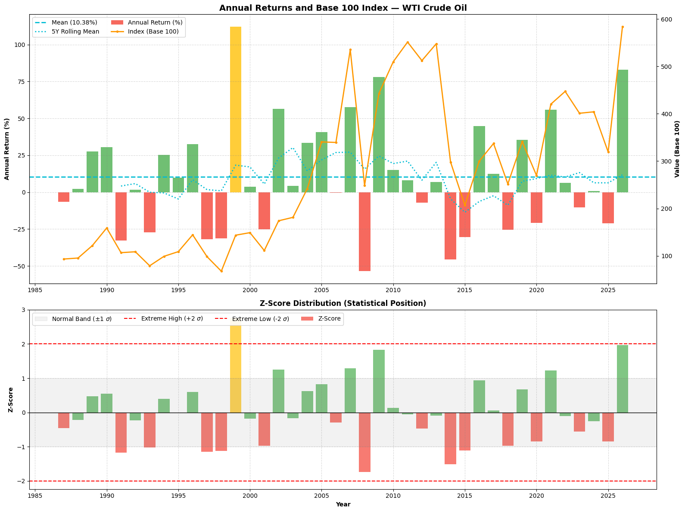
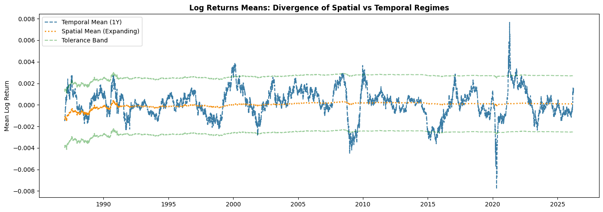
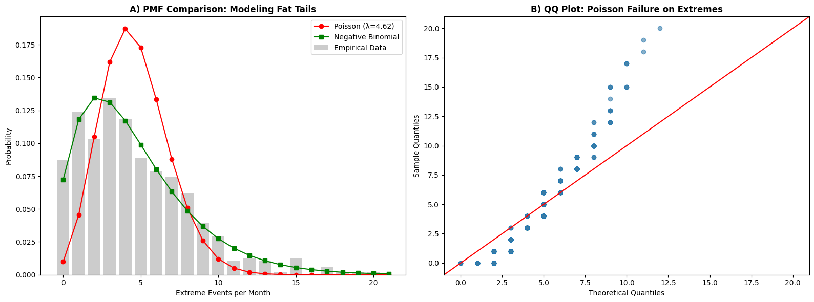
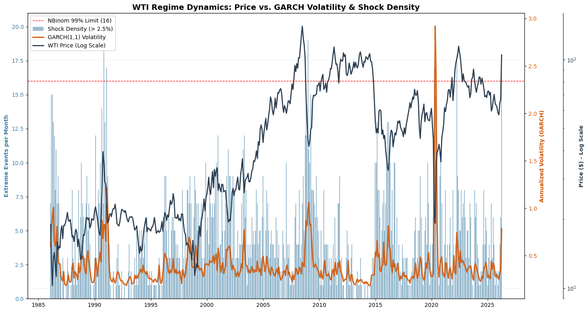

# Non-Linear Volatility Dynamics and Shock Density
> **Modeling Market Satiation via NBinom-GARCH in WTI Crude Oil**

This repository contains a quantitative framework designed to identify structural exhaustion regimes in the WTI Crude Oil market. The model integrates a Negative Binomial distribution with GARCH(1,1) conditional volatility to create an **Early Warning System (EWS)** based on liquidity saturation.

---

## 1. Statistical Analysis and Fat Tails
The model starts from the premise that WTI returns do not follow a normal distribution. The presence of "fat tails" is clearly visible through the analysis of historical Z-Scores.

*Figure 1: Z-Score Distribution. Systematic violations of the ±2σ bands confirm the leptokurtic nature of returns.*

---

## 2. Ergodicity Check
To validate the model, the divergence between spatial and temporal means was analyzed. The chart shows how the system enters non-ergodic regimes during crisis periods, making historical averages inadequate for immediate risk assessment.

*Figure 2: Divergence between rolling means and expanding means, highlighting structural market breaks.*

---

## 3. Methodology: NBinom vs. Poisson
Due to significant overdispersion in price shocks ($\sigma^2 \gg \mu$), a standard Poisson distribution is insufficient. This model uses a **Negative Binomial** distribution to accurately map the density of extreme events (>2.5%).

*Figure 3: Distribution Fit Comparison. The NBinom (green) successfully captures the probability of rare events compared to the Poisson (red) model.*

---

## 4. Regime Dynamics and 2026 Signal
The core of the project is the identification of a critical threshold: **16 monthly events**. When this density is reached, the market enters an exhaustion phase.

*Figure 4: Integration of Shock Density, GARCH Volatility, and Price. The current 2026 signal shows a record-breaking slope of 3.28.*

---

## Key Results
* **Satiation Threshold:** 16 extreme events per month (99th percentile).
* **Mean Stress at Signal:** Volatility Z-Score of **4.15 $\sigma$**.
* **Vulnerability Window:** Median of **19.0 trading days** for structural settlement.
* **2026 Outlook:** The model currently signals a "statistical ceiling" due to the extreme kinetic energy of the current trend.
